<!--
  GitHub profile README — Character Dossier
  Note: raw HTML/CSS/JS in README.md will NOT render.
  Complex visuals are shipped as SVG (assets/dossier.svg).
-->

  

   

  
  

---

### Loadout

`Next.js` · `Laravel` · `Golang` · `TypeScript` · `AI Integration`

### Currently

Back End Developer @ **Akasia** — building financial-grade systems & banking integrations.

### Elsewhere

- Portfolio: [bimayanuar.vercel.app](https://bimayanuar.vercel.app)
- Email: [bima.aji1380@gmail.com](mailto:bima.aji1380@gmail.com)
- GitHub: [@Bima1301](https://github.com/Bima1301)

  
  

